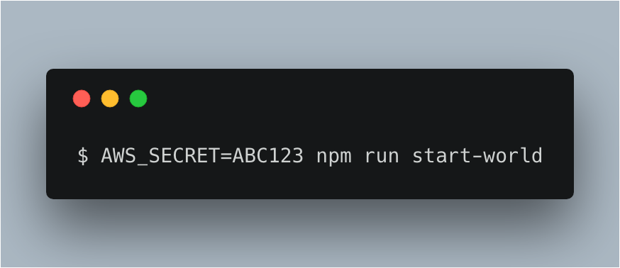
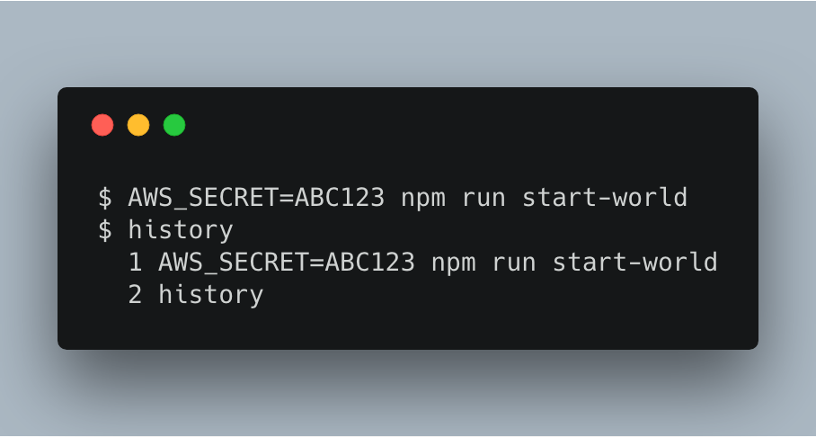
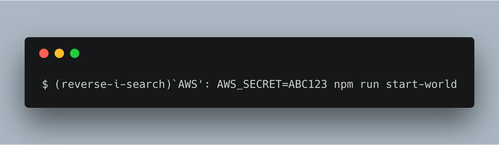
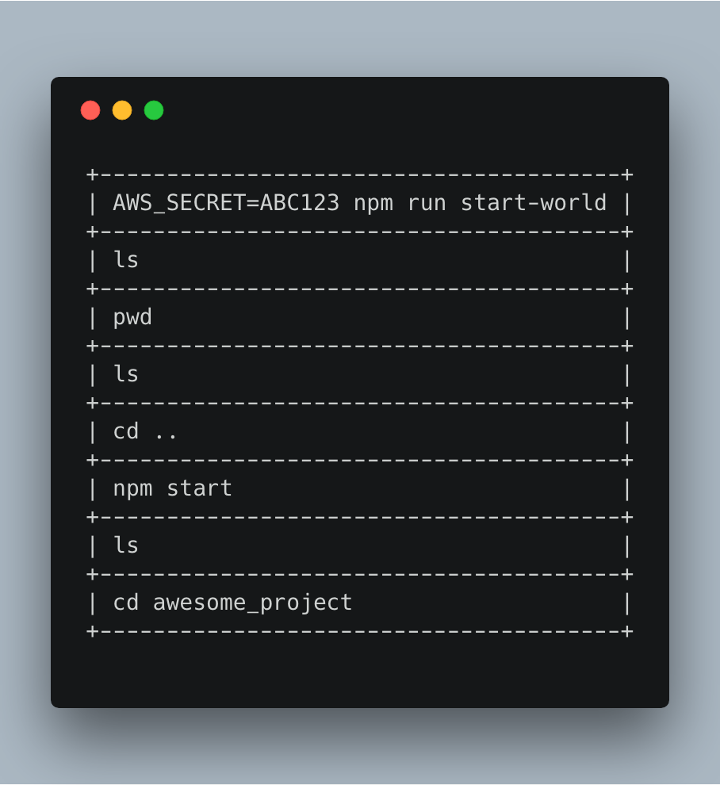
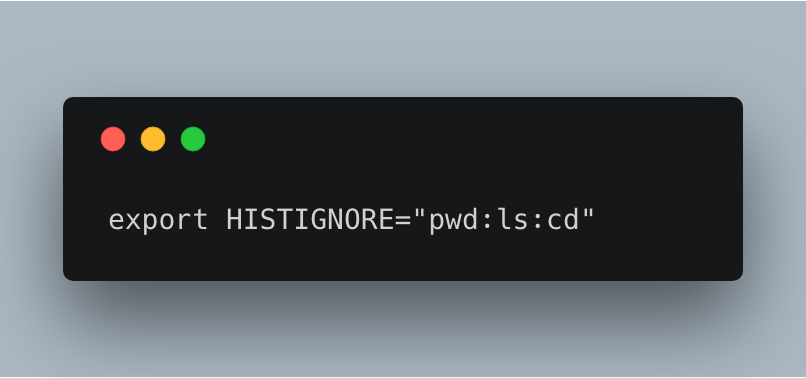
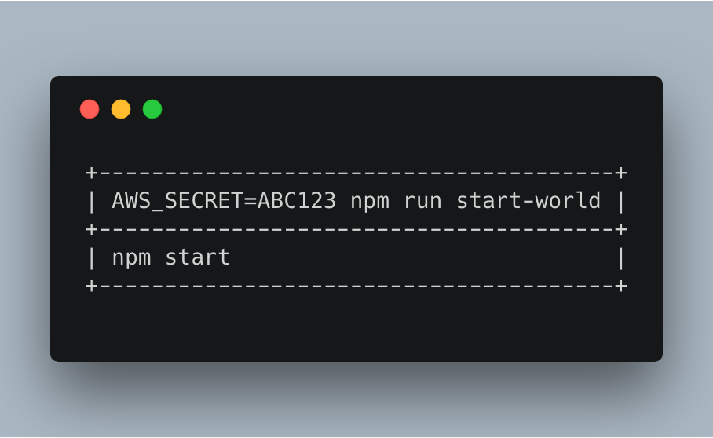
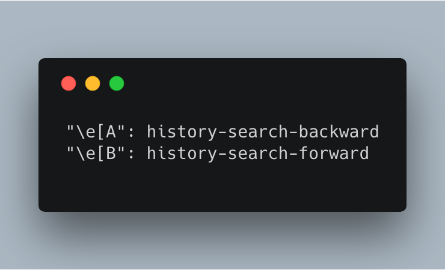
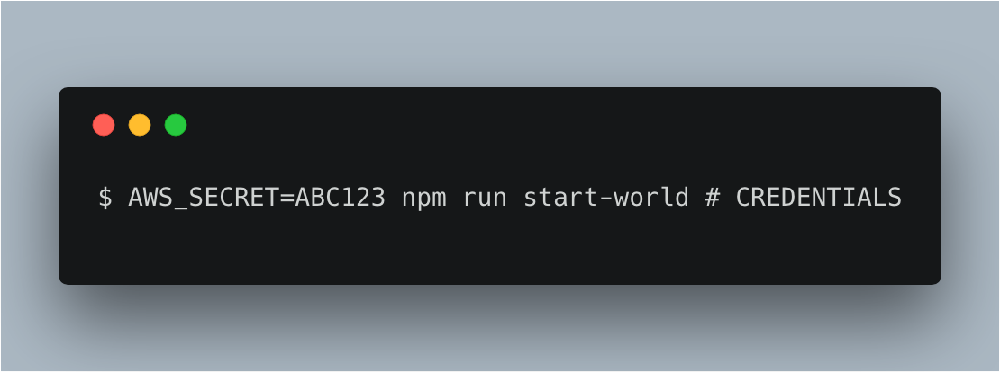
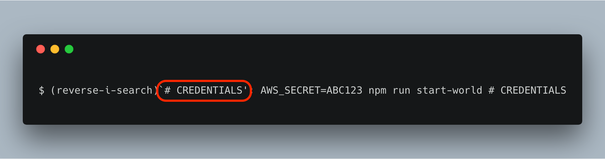

This article is intended for Mac users

# Use reverse-i-search to quickly navigate through your history

You type a long command into your terminal to start up your program. Now you want to do it again. The easiest option is to retype the entire command. Your typing speed might improve. Or, you will get tired of programming 😪. 

Let's take a look at some alternatives.

## Using the arrow keys
You can press the up and down arrows in your terminal to navigate through your history. This navigates through your history chronologically. Pressing the up arrow will go one entry earlier in your history. Pressing the down arrow will go one entry later in your history.

This is convenient for commands that you ran 5 minutes ago. But it can get unwieldy when you are searching for an obscure command you used 5 days ago.

## Side note: Where is this history kept?
Your machine saves the history of your commands into a file. Think of it like your web browser's history.
You can run `history` to view the history of all your recently executed commands.

You can also open the `~/.bash_history` file to view the same results.

## reverse-i-search, a better way of searching
You ran an AWS command in your terminal 5 days ago. Unluckily for you, you don't remember the obscure StackOverflow question that contained it. Of course, you also forgot to document this command. You can use the arrow keys, but this will go through all the commands you executed in your terminal since last week.

Instead, we can use `reverse-i-search`. 

> Search backward starting at the current line and moving ‘up’ through the history as necessary. This is an incremental search.
([source](https://www.gnu.org/software/bash/manual/html_node/Commands-For-History.html))

Press the `ctrl` key and the `r` key simultaneously. A prompt will appear like so:

Start typing what you remember of your command. You will see the latest command from your `history` that matches your search term.

Press `ctrl + r` again to navigate through earlier entries in your `history` that match your search term.

## Helpful tips and tricks
### Using HISTIGNORE="pwd"
The up and down arrows are useful to grab recently used commands. However, it navigates through *ALL* your commands, including commonly used ones that you probably were not looking for. You're not looking for an `ls` or `pwd` command to execute again.

You can update your `~/.bashrc` file with a `HISTIGNORE` entry to filter your history.

Now, you will no longer have a `history` filled with useless `pwd` and `ls` commands that you don't intend to reuse. Beautiful.

Note that `HISTIGNORE` does not affect what is currently saved in your `~/.bash_history` file. It will only prevent *FUTURE* entries from getting saved into your `~/.bash_history` file.

### Update .inputrc file with a shortcut
Start typing `git` into your terminal. Then, press the up arrow. Your terminal is now populated with your most recently executed command.

It might be convenient to only see history that matches what you have typed in your terminal (doing a `reverse-i-search` using the term that is currently present).

We can update the `~/.inputrc` file to get this desired effect.

\e is an escape character. [A and [B are escape codes for the up and down arrows. ([see here for more escape codes](https://espterm.github.io/docs/VT100%20escape%20codes.html))

### Using comments in your commands
Do you work on different projects that use different commands? Or do you want a convenient way to filter your searches by category (rather than search term)?

You can do that with comments. 

When running commands in your terminal, you can add comments with `#`.

After doing this, you can use `reverse-i-search` to filter by these commands.

.

As usual, you can also use `ctrl + r` again to navigate through earlier entries in your `history` that match your search term.

# Resources
* [Adding shortcut commands to your .inputrc file](http://codeinthehole.com/tips/the-most-important-command-line-tip-incremental-history-searching-with-inputrc/)
* [More escape codes](https://espterm.github.io/docs/VT100%20escape%20codes.html)