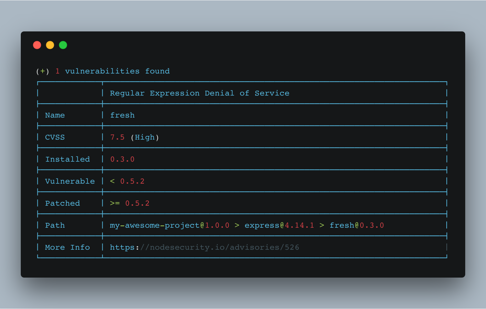

# Find vulnerabilities in your node app

`nsp` (or Node Security Platform) is a "CLI tool that helps identify known vulnerabilities" in your own node applications. See their [Github repository here](https://github.com/nodesecurity/nsp).

Getting started with the CLI tool is very simple.


```shell
cd my-awesome-project
# Navigate to your project

npm install nsp
# Install the nsp CLI into your project

./node_modules/.bin/nps check
# Check for vulnerabilities inside your project
```



Any vulnerabilities caught by `nsp` will be shown in your output. Among other information, it:
  * tells you which dependencies have vulnerabilities
  * shows a [CVSS Score](https://en.wikipedia.org/wiki/Common_Vulnerability_Scoring_System) showing the severity of the vulnerability
  * shows which version the dependency was patched
  * provides a link for more information about the vulnerability

Update any vulnerabilities you see!
