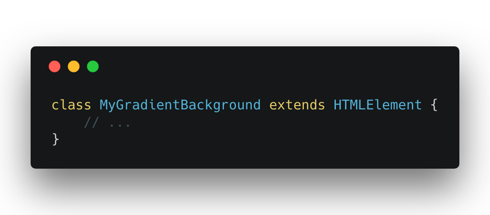
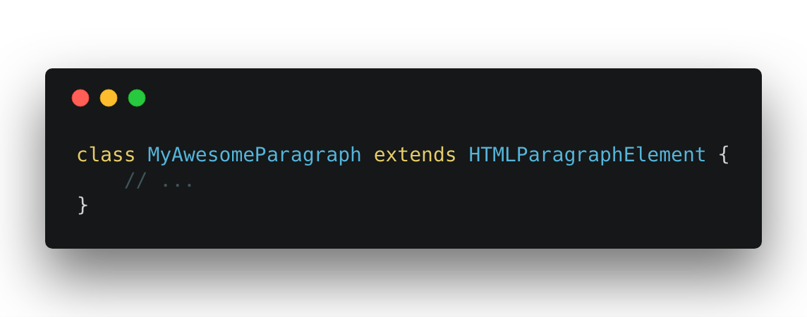
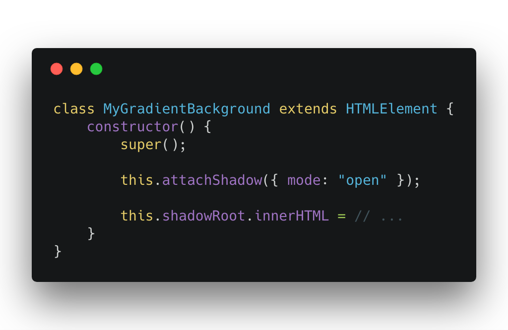
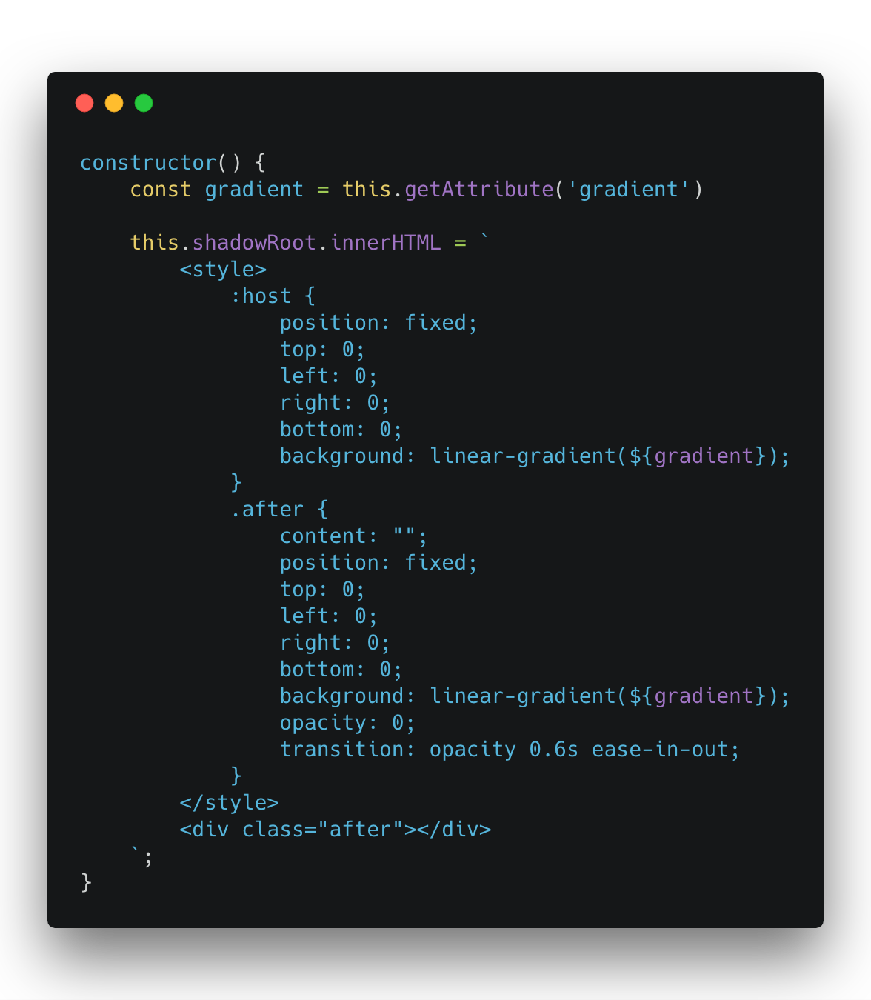
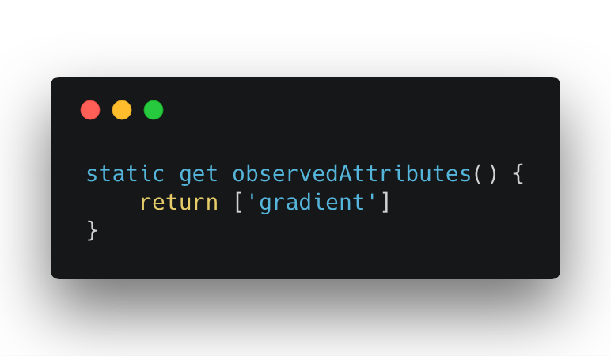
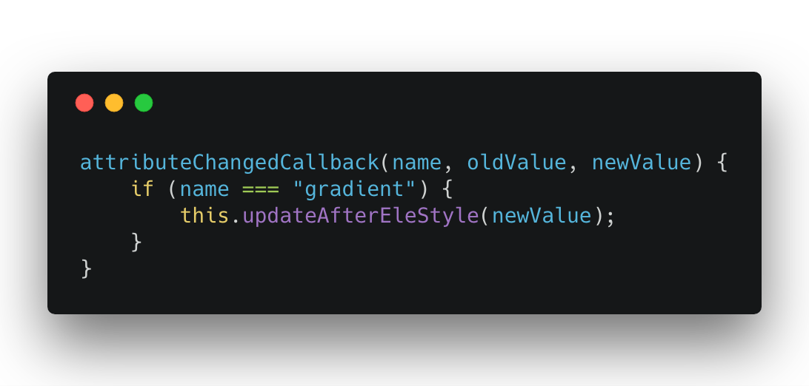
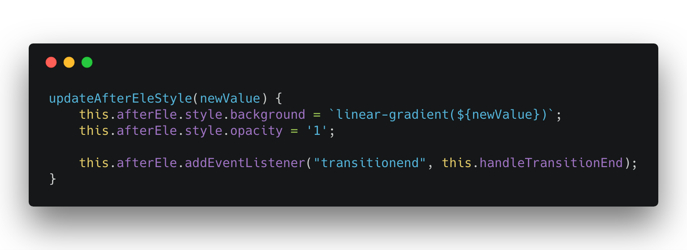
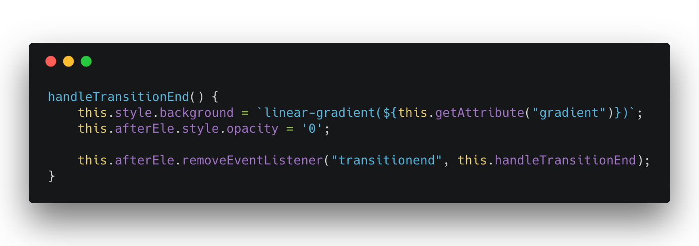

In this article, we will learn about Web Components. Web Components are a suite of different technologies that allow you to create reusable custom elements. Using a custom element is no different than using a div. You can create instances in your HTML. You can create an instance with JavaScript. You can attach event listeners to custom elements.
Have you ever looked at the HTML specs and thought the authors left out an important element? This is the solution for you. Custom elements provide a way for developers to build their own fully-featured DOM elements.

# Difference between Custom Elements and Web Components?
Many use the terms Custom Elements and Web Components interchangeably. Web Components are a suite of different technologies, which includes Custom Elements, Shadow DOM, and HTML Imports. Custom Elements has its own specifications. https://w3c.github.io/webcomponents/spec/custom/
// TODO Include webcomponent.png

Web Components are a native feature of the browser. You don't need external libraries to use this functionality. You can see the browser support table here labeled Browser Support.
// Include picture of browser support
You can see the support for Custom Elements here. (https://caniuse.com/#feat=custom-elementsv1)
You can see the support for templates here. (https://caniuse.com/#feat=imports)
You can see the support for Shadow DOM here. (https://caniuse.com/#feat=shadowdomv1)

# So this is React?
React and Web Components solve different problems. Web Components provide strong encapsulation for reusable components. React provides a declarative library that keeps the DOM in sync with your data.
React makes no differentiation between a native HTML element and a Web Component. It would handle your custom built Web Component like it does a normal HTML element.
See this example of a React application using a Web Component. https://codesandbox.io/s/746omm2kwq
The React documentation also shows how you can use React within your Web Components. I haven't found a scenario that would warrant importing React.

# Let's transition gradient backgrounds
We're going to build a gradient Web Component like the one below.

Notice how it transitions between gradient backgrounds. We cannot transition backgrounds by default. https://codepen.io/newyork-anthonyng/pen/PyJJmr

But we can transition opacity. 
https://codepen.io/newyork-anthonyng/pen/mzBBBg?editors=1100

We can take advantage of this with CSS pseudo-classes to get the desired effect.
https://codepen.io/newyork-anthonyng/pen/MPEEPo?editors=1100

We can take advantage of this with the CSS "before" pseudo-class to get the desired effect.
https://codepen.io/newyork-anthonyng/pen/MPEEPo?editors=1100

There is a layer (div) with a gradient color. There is a second layer (div::before) with a different gradient color. This second layer sits on top of the first layer and has opacity: 0. To start the gradient transition, we transition the second layer's opacity from 0 to 1. This gives us the effect that the gradient is transitioning.

As a developer, that's a lot of things you have to know about. 

Wouldn't it be nice to have a simple, declarative way of using this gradient? Imagine an HTML element called <my-gradient-background>. It accepts a "gradient" attribute that takes a gradient color, like "red, white, blue". When we change the "gradient", the gradient color will transition like we want. That is what we are going to create.

To create a new Web Component, we declare a new class that extends HTMLElement. 

If you want to extend the functionality of an existing HTML element, you can extend from them instead. For example, to extend the functionality of a 
, you would extend HTMLParagraphElement.

We attach a shadow root to our web component. The shadow DOM API lets us attach DOM to our gradient element. This shadow DOM is encapsulated in our component and is (generally) hidden from the rest of the DOM. https://developer.mozilla.org/en-US/docs/Web/Web_Components/Using_shadow_DOM

In our shadow DOM, we add some styling for the gradient element. We use a 
 instead of a pseudo-element here. This is because we want to reference this layer with JavaScript. We can't reference pseudo-elements with JavaScript.

The "host" element is the gradient element itself. We can style it as if it were a div element.

In the observed attributes, we return a list of HTML attributes that we want to watch. When these watched attributes change, our a callback function will fire.

Our attributeChangedCallback function fires whenever an observed attribute changes. We get 3 arguments in our callback function. The first argument is the name of the attribute that changed. The second argument is the value of the attribute before it changed. The third argument is the value of the attribute after it changed.
In our callback function, we update our "after" element.

We update our "after" element's background color with the new gradient color. We also set its' opacity to 1. Our "after" element will start fading in, creating our desired effect. We want to do some cleanup code when the "after" element has finished fading in.

Our "after" element does all the work of creating the gradient transition effect. We set our "host" element to the new gradient color. We hide the "after" element so that it's ready for the next fade in. That is all the clean up we need.

To use this new Web Component, we have to define it like so.

Now, you'll be able to use <my-gradient-background> like a normal HTML element.

You can view the complete code [here](https://github.com/newyork-anthonyng/my-gradient-background/blob/master/index.js).
Feel free to download it with `npm install --save my-gradient-background`.